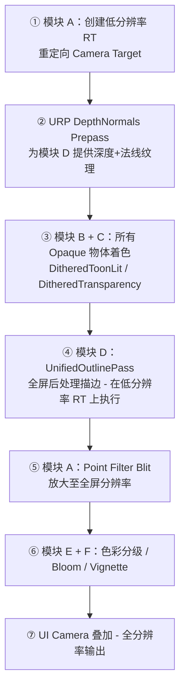
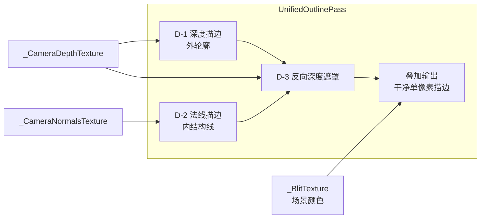
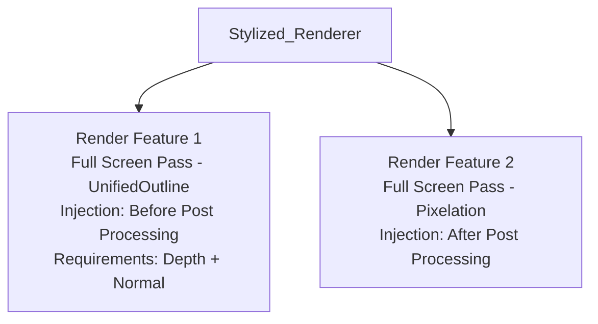

# 《斗笔》URP 视觉风格实现计划

> 项目：Pen —— 钢笔弹射对战游戏  
> Unity 版本：6000.3.11f1（Unity 6）  
> URP 版本：17.3.0

---

## 一、目标视觉风格

低分辨率像素化 + 卡通着色 + 统一后处理描边，营造"课桌上的文具大战"手绘感。

---

## 二、模块总览与渲染时序

### 2.1 六大模块

| 模块 | 名称 | 核心职责 |
|------|------|----------|
| **A** | PixelationPass ✅ | 低分辨率 RT + Point Filter 放大 |
| **B** | DitheredToonLit | 卡通光照着色（阶梯化漫反射 + 抖动阴影） |
| **D** | UnifiedOutlinePass | 统一后处理描边（深度+法线+反向遮罩） |
| **C** | DitheredTransparency | 伪透明（抖动剔除模拟半透明） |
| **E** | ColorGrading | 色彩分级（Volume Profile） |
| **F** | PostFX | Bloom / Vignette 等后处理效果 |

### 2.2 渲染时序图



---

## 三、实施顺序

按路线图建议调整为 **A → B → D → C → E/F**。将 D（描边）提前到 C（伪透明）之前，原因：描边效果就位后，调试 Dithered Transparency 时可直观判断伪透明物体轮廓是否清晰，描边作为视觉锚点加速迭代。

---

## 四、模块 A — PixelationPass（像素化）

### 4.1 目标

将整个 3D 场景渲染到一个低分辨率 RenderTexture（如 480×270），最终通过 Point Filter 放大到屏幕分辨率，产生像素化效果。

### 4.2 实现方案

**方案：手写 HLSL + 自定义 `ScriptableRendererFeature`**

> ⚠️ **不要使用 URP 内置的 Full Screen Pass Renderer Feature**。因为内置 RF 无法从 C# 侧动态向材质写入参数（如 `_PixelSize`），且无法精细控制 RenderGraph 双步 Blit 流程。必须自定义 `ScriptableRendererFeature`。

#### 需要创建的文件

| 文件 | 路径 | 说明 |
|------|------|------|
| `S_Pixelation.shader` | `Assets/Shaders/PostProcess/S_Pixelation.shader` | 像素化全屏 Shader |
| `M_Pixelation.mat` | `Assets/Material/PostProcess/M_Pixelation.mat` | 对应材质（Shader 选 `Pen/PostProcess/S_Pixelation`） |
| `PixelationRendererFeature.cs` | `Assets/Scripts/Rendering/PixelationRendererFeature.cs` | 自定义 Renderer Feature |

#### Shader 核心逻辑（UV Snapping 方案）

```hlsl
// 正确写法 — UV Snapping（等效 Point 采样，无需实际创建低分辨率 RT）
// _BlitTexture 由 RenderGraph BlitMaterialParameters 通过 MaterialPropertyBlock 自动绑定
// _PixelSize 由 RendererFeature 通过 material.SetFloat 动态写入

// include：使用 URP Core.hlsl，不要 include Blit.hlsl（路径在此版本不可用）
#include "Packages/com.unity.render-pipelines.universal/ShaderLibrary/Core.hlsl"

TEXTURE2D(_BlitTexture);
float4 _BlitScaleBias;  // Blitter 标准 uniform，必须声明
float  _PixelSize;

// SamplerState 用命名约定（sampler_linear_clamp），不用 SAMPLER() 宏重复声明
SamplerState sampler_linear_clamp;

half4 Frag(Varyings input) : SV_Target
{
    float2 uv = input.texcoord;
    float ps = max(1.0, _PixelSize);
    float2 pixelUVSize = ps / _ScreenParams.xy;  // 每个像素块在 UV 空间的大小
    float2 snappedUV = floor(uv / pixelUVSize) * pixelUVSize + pixelUVSize * 0.5;
    return SAMPLE_TEXTURE2D(_BlitTexture, sampler_linear_clamp, snappedUV);
}
```

#### C# RendererFeature 关键实现

```csharp
// 命名空间：UnityEngine.Rendering.RenderGraphModule.Util
// using static RenderGraphUtils 才能直接用 BlitMaterialParameters

public override void RecordRenderGraph(RenderGraph renderGraph, ContextContainer frameData)
{
    var resourceData = frameData.Get<UniversalResourceData>();
    TextureHandle activeColor = resourceData.activeColorTexture;

    // Step 1：复制当前帧到临时纹理
    var desc = renderGraph.GetTextureDesc(resourceData.cameraColor);
    desc.name = "_PixelationColorCopy"; desc.clearBuffer = false;
    TextureHandle colorCopy = renderGraph.CreateTexture(desc);
    renderGraph.AddBlitPass(activeColor, colorCopy, Vector2.one, Vector2.zero, passName: "Pixelation_CopyColor");

    // Step 2：用像素化材质渲染回相机颜色 RT
    var blitParams = new BlitMaterialParameters(colorCopy, activeColor, _material, 0);
    renderGraph.AddBlitPass(blitParams, passName: "Pixelation_Apply");
}
```

#### URP Renderer 配置

1. 打开 `PC_Renderer.asset`（或项目实际使用的 Renderer Data）
2. **Add Renderer Feature** → 选择 `Pixelation Renderer Feature`（自定义类，非内置）
3. `Pixel Size` = **4**（像素块大小，可运行时调节）
4. `Render Pass Event` = **After Rendering Post Processing**
5. `Pixelation Material` = 拖入 `M_Pixelation`（基于 `S_Pixelation.shader` 的材质）

### 4.3 验证标准

- 场景呈现明显像素化外观
- 像素块大小均匀，无拉伸
- UI 层不受像素化影响（通过 Camera Stack 隔离）

---

## 五、模块 B — DitheredToonLit（卡通着色）

### 5.1 目标

为所有不透明文具模型提供卡通风格光照：阶梯化漫反射（2~3 阶色阶）、可选抖动阴影过渡。

### 5.2 实现方案

**方案：手写 URP Lit Shader（Custom Lighting）**

#### 需要创建的文件

| 文件 | 路径 | 说明 |
|------|------|------|
| `S_DitheredToonLit.shader` | `Assets/Shaders/Toon/S_DitheredToonLit.shader` | 卡通光照 Shader |
| `T_BayerMatrix.png` | `Assets/Textures/Dither/T_BayerMatrix.png` | 4×4 Bayer 抖动矩阵纹理 |

#### Shader 核心逻辑

```hlsl
// 伪代码
// 1. 计算 NdotL（标准 Lambert）
float NdotL = saturate(dot(normalWS, mainLightDir));

// 2. 阶梯化（Cel Shading）— 2~3 阶
float toon = step(_ShadowThreshold, NdotL);

// 3. 可选：在阴影边界使用 Bayer 抖动平滑过渡
float dither = tex2D(_BayerMatrix, screenUV * _BayerTiling).r;
toon = step(dither, NdotL * _DitherRange + _DitherBias);

// 4. 混合亮面色与暗面色
float3 finalColor = lerp(_ShadowColor, _BaseColor, toon) * albedo;
```

#### 关键可调参数

| 参数 | 说明 | 推荐默认值 |
|------|------|-----------|
| `_BaseColor` | 亮面基色 | 白色 |
| `_ShadowColor` | 暗面颜色 | 偏冷灰 |
| `_ShadowThreshold` | 明暗分界阈值 | 0.5 |
| `_DitherRange` | 抖动过渡范围 | 0.1 |
| `_BayerTiling` | Bayer 矩阵平铺密度 | 与低分辨率像素对齐 |

### 5.3 验证标准

- 光照呈现明显的明暗两阶/三阶分界
- 阴影边界有可见的抖动过渡（像素化后更明显）
- 接收 URP 主光源方向 + 颜色

---

## 六、模块 D — UnifiedOutlinePass（统一后处理描边）

### 6.1 目标

通过一个 Fullscreen Pass 完成所有描边，内部三层计算叠加输出干净的单像素描边。

### 6.2 架构设计



### 6.3 前置条件

- **必须开启 URP DepthNormals Prepass**：在 `Stylized_Renderer` 的 Renderer Data 中，将 `Depth Texture Mode` 设为 `Force Prepass`，或确保有 Render Feature 要求 `DepthNormals`
- Unity 6 URP 17.x 中，可在 Universal Renderer Data 的 `Rendering` 区域勾选 `Depth Priming Mode` 并确保 Normals 纹理生成

### 6.4 实现方案

**路径一（原型阶段）：Fullscreen Shader Graph**

> Unity 6 URP 17.x 完整支持 Fullscreen Shader Graph。可用 `URP Sample Buffer` 节点直接采样 `_CameraDepthTexture` 和 `_CameraNormalsTexture`。适合快速迭代调参。

**路径二（最终版本）：手写 HLSL + Full Screen Pass Renderer Feature**

> 将描边逻辑写成独立 `.shader` 文件。性能可控，便于扩展（如 Stencil 差异化描边颜色）。

#### 建议：原型阶段先用路径一快速验证效果，定型后迁移到路径二。

#### 需要创建的文件

| 文件 | 路径 | 说明 |
|------|------|------|
| `S_UnifiedOutline.shader` | `Assets/Shaders/PostProcess/S_UnifiedOutline.shader` | 描边全屏 Shader |
| `M_UnifiedOutline.mat` | `Assets/Materials/PostProcess/M_UnifiedOutline.mat` | 对应材质 |

#### D-1 深度描边（外轮廓）核心逻辑

```hlsl
// 伪代码 — 采样中心 + 上下左右 4 邻域的线性深度
float depthC = LinearEyeDepth(SampleDepth(uv), _ZBufferParams);
float depthU = LinearEyeDepth(SampleDepth(uv + float2(0, texelSize.y)), _ZBufferParams);
float depthD = LinearEyeDepth(SampleDepth(uv - float2(0, texelSize.y)), _ZBufferParams);
float depthL = LinearEyeDepth(SampleDepth(uv - float2(texelSize.x, 0)), _ZBufferParams);
float depthR = LinearEyeDepth(SampleDepth(uv + float2(texelSize.x, 0)), _ZBufferParams);

float depthDiff = max(
    max(abs(depthU - depthC), abs(depthD - depthC)),
    max(abs(depthL - depthC), abs(depthR - depthC))
);

float depthEdge = step(_DepthThreshold, depthDiff);
```

#### D-2 法线描边（内结构线）核心逻辑

```hlsl
// 伪代码 — 采样 4 邻域法线，求 dot 差异
float3 normalC = SampleNormal(uv);
float3 normalU = SampleNormal(uv + float2(0, texelSize.y));
float3 normalD = SampleNormal(uv - float2(0, texelSize.y));
float3 normalL = SampleNormal(uv - float2(texelSize.x, 0));
float3 normalR = SampleNormal(uv + float2(texelSize.x, 0));

float normalDiff = max(
    max(1.0 - dot(normalC, normalU), 1.0 - dot(normalC, normalD)),
    max(1.0 - dot(normalC, normalL), 1.0 - dot(normalC, normalR))
);

float normalEdge = step(_NormalThreshold, normalDiff);
```

#### D-3 反向深度遮罩（消除双重线）核心逻辑

```hlsl
// 伪代码 — 关键技巧：深度差越大，遮罩值越趋近 0
float depthMask = 1.0 - saturate(depthDiff * _MaskScale);

// 法线描边在外轮廓处被遮罩消隐
float maskedNormalEdge = normalEdge * depthMask;

// 最终叠加
float finalEdge = saturate(depthEdge + maskedNormalEdge);

// 混合到场景颜色
float3 sceneColor = SAMPLE_TEXTURE2D(_BlitTexture, sampler_BlitTexture, uv).rgb;
float3 outlineColor = _OutlineColor.rgb;
float3 result = lerp(sceneColor, outlineColor, finalEdge);
```

#### 关键可调参数

| 参数 | 说明 | 推荐默认值 |
|------|------|-----------|
| `_DepthThreshold` | 深度差异阈值 | 0.5 |
| `_NormalThreshold` | 法线差异阈值 | 0.4 |
| `_MaskScale` | 反向遮罩缩放系数 | 5.0 |
| `_OutlineColor` | 描边颜色 | 纯黑 (0,0,0,1) |

#### URP Renderer 配置

1. 在 `Stylized_Renderer` 上添加 **Full Screen Pass Renderer Feature**
2. 设置 `Pass Material` = `M_UnifiedOutline`
3. `Injection Point` = **Before Rendering Post Processing**（在像素化之前执行）
4. `Requirements` = **Depth** + **Normal**（确保生成所需纹理）
5. `Fetch Color Buffer` = true

### 6.5 描边颜色策略（后期扩展）

初期统一使用纯黑描边。后期可扩展：

| 策略 | 实现方式 | 效果 |
|------|----------|------|
| 冷暖描边 | 采样 `_BlitTexture` 亮度，亮面偏暖深棕、暗面偏冷深蓝 | 融入午后阳光氛围 |
| 阵营描边 | 利用 Stencil Buffer 区分敌我，不同 Stencil 值映射不同描边颜色 | 增强战斗可读性 |

### 6.6 为什么放弃 Inverted Hull

| 维度 | Inverted Hull | 纯后处理 |
|------|---------------|----------|
| Draw Call | 每模型额外 1 个 Pass | 固定 1 个全屏 Pass |
| 描边粗细一致性 | 依赖顶点法线质量，低多边形易断线 | 像素级均匀 |
| 内部结构线 | ❌ 无法捕捉 | ✅ 法线描边覆盖 |
| 性能开销 | 随物体数量线性增长 | 恒定（与物体数无关） |
| 适用场景 | 少量大模型 | ✅ 小物件密集战场 |

### 6.7 验证标准

- 物体外轮廓有清晰的单像素描边
- 同一物体几何折面可见内部结构线（如铅笔棱角）
- 外轮廓处无双重线（2px 粗线）
- 描边在像素化后呈现为 1 个低分辨率像素宽

---

## 七、模块 C — DitheredTransparency（伪透明）

### 7.1 目标

对需要"半透明"效果的物体（如幽灵橡皮、技能特效），使用抖动剔除（Dithered Clip）模拟透明，避免排序问题。

### 7.2 实现方案

基于模块 B 的 `S_DitheredToonLit.shader` 扩展一个变体或创建独立 Shader。

#### 需要创建的文件

| 文件 | 路径 | 说明 |
|------|------|------|
| `S_DitheredTransparency.shader` | `Assets/Shaders/Toon/S_DitheredTransparency.shader` | 抖动伪透明 Shader |

#### 核心逻辑

```hlsl
// 伪代码 — 使用 Bayer 矩阵进行抖动剔除
float dither = tex2D(_BayerMatrix, screenUV * _BayerTiling).r;
clip(_Opacity - dither);  // _Opacity < dither 的像素被剔除

// 剩余像素正常执行 DitheredToonLit 着色
```

### 7.3 关键特性

- 物体仍作为 **Opaque** 渲染，无需 Alpha Blend → 无排序问题
- 写入深度 → 描边 Pass 可正确检测其轮廓
- `_Opacity` 参数可由脚本动态控制（如受伤淡出效果）

### 7.4 验证标准

- 调节 `_Opacity` 时物体呈现像素化的"溶解"效果
- 伪透明物体仍有正确的描边轮廓
- 不出现半透明排序穿帮

---

## 八、模块 E/F — 后处理效果

### 8.1 目标

通过 URP Volume Profile 实现色彩分级、Bloom、Vignette 等氛围效果。

### 8.2 实现方案

使用 URP 内置后处理栈，在 Volume Profile 中配置。

#### 需要创建/配置的文件

| 文件 | 路径 | 说明 |
|------|------|------|
| `StylizedVolumeProfile.asset` | `Assets/Settings/StylizedVolumeProfile.asset` | 风格化 Volume Profile |

#### Volume 效果配置

| 效果 | 关键参数 | 推荐值 |
|------|----------|--------|
| **Color Adjustments** | Saturation | 微降 -10~-20（偏淡彩） |
| **Lift Gamma Gain** | Shadows 偏冷蓝、Highlights 偏暖橙 | 强化冷暖对比 |
| **Bloom** | Threshold = 0.9, Intensity = 0.3 | 微弱辉光，不过曝 |
| **Vignette** | Intensity = 0.25 | 轻微暗角聚焦视线 |
| **Tonemapping** | Mode = Neutral | 保持卡通色彩不过度压缩 |

### 8.3 验证标准

- 画面呈现"温暖午后课桌"氛围
- Bloom 不会让亮面过曝
- 暗角自然引导视线到战场中心

---

## 九、URP Renderer 配置总览

### 9.1 需要从零创建的 Renderer

| 资产 | 路径 | 说明 |
|------|------|------|
| `Stylized_Renderer.asset` | `Assets/Settings/Stylized_Renderer.asset` | 风格化 Universal Renderer Data |
| `Stylized_RPAsset.asset` | `Assets/Settings/Stylized_RPAsset.asset` | 风格化 URP Asset（引用上述 Renderer） |

### 9.2 Renderer Feature 挂载顺序



> **注意**：描边在后处理之前执行，这样描边线条也会被后处理（Bloom/Color Grading）统一处理；像素化在最后执行，确保所有内容都被像素化。

### 9.3 URP Asset 关键配置

| 配置项 | 值 | 原因 |
|--------|-----|------|
| `Depth Texture` | ✅ On | 模块 D 深度描边必需 |
| `Opaque Texture` | ✅ On | 全屏 Pass 采样场景颜色 |
| `Render Scale` | 1.0 | 像素化由自定义 Shader 实现，不使用 URP 内置降采样 |
| `Anti Aliasing` | None | 像素化风格不需要抗锯齿 |
| `HDR` | ✅ On | Bloom 需要 HDR 色域 |
| `ShadowMap` | 根据需要 | 卡通着色可使用或不使用 ShadowMap |

---

## 十、目录结构规划

```
Assets/
├── Shaders/
│   ├── PostProcess/
│   │   ├── S_Pixelation.shader          ← 模块 A：像素化
│   │   └── S_UnifiedOutline.shader      ← 模块 D：统一描边
│   ├── Toon/
│   │   ├── S_DitheredToonLit.shader     ← 模块 B：卡通着色
│   │   └── S_DitheredTransparency.shader← 模块 C：伪透明
│   └── Include/
│       └── DitherUtils.hlsl             ← 共享抖动工具函数
├── Materials/
│   ├── PostProcess/
│   │   ├── M_Pixelation.mat             ← 像素化材质
│   │   └── M_UnifiedOutline.mat         ← 描边材质
│   └── Toon/
│       └── M_ToonDefault.mat            ← 卡通着色默认材质
├── Textures/
│   └── Dither/
│       └── T_BayerMatrix.png            ← 4×4 Bayer 抖动矩阵
└── Settings/
    ├── Stylized_Renderer.asset          ← 风格化 Renderer Data
    ├── Stylized_RPAsset.asset           ← 风格化 URP Asset
    └── StylizedVolumeProfile.asset      ← 风格化 Volume Profile
```

---

## 十一、分步实施计划

### 阶段 1 ✅：模块 A — 像素化基础

- [ ] 创建 `Stylized_Renderer.asset` 和 `Stylized_RPAsset.asset`，配置基础 URP 参数
- [ ] 创建 `Assets/Shaders/PostProcess/S_Pixelation.shader`（全屏像素化 HLSL）
- [ ] 创建 `Assets/Materials/PostProcess/M_Pixelation.mat` 并关联 Shader
- [ ] 在 Renderer 上添加 Full Screen Pass Renderer Feature，挂载像素化材质
- [ ] 在场景中将 Camera 切换到 Stylized Renderer 验证像素化效果

### 阶段 2：模块 B — 卡通着色

- [ ] 创建 `Assets/Textures/Dither/T_BayerMatrix.png`（4×4 Bayer 矩阵）
- [ ] 创建 `Assets/Shaders/Include/DitherUtils.hlsl`（抖动采样工具函数）
- [ ] 创建 `Assets/Shaders/Toon/S_DitheredToonLit.shader`（卡通光照 HLSL）
- [ ] 创建 `Assets/Materials/Toon/M_ToonDefault.mat` 并赋给场景中文具模型
- [ ] 验证卡通光照阶梯化效果 + 抖动阴影过渡

### 阶段 3：模块 D — 统一描边

- [ ] 确保 URP Renderer 开启 DepthNormals Prepass（Depth Texture + Normal 输出）
- [ ] 创建 `Assets/Shaders/PostProcess/S_UnifiedOutline.shader`，实现 D-1/D-2/D-3 三层逻辑
- [ ] 创建 `Assets/Materials/PostProcess/M_UnifiedOutline.mat` 并关联 Shader
- [ ] 在 Renderer 上添加第二个 Full Screen Pass Renderer Feature（描边），设置 Injection Point = Before Post Processing
- [ ] 调整 `_DepthThreshold`、`_NormalThreshold`、`_MaskScale` 三个关键参数
- [ ] 验证：外轮廓清晰、内结构线可见、无双重线

### 阶段 4：模块 C — 伪透明

- [ ] 创建 `Assets/Shaders/Toon/S_DitheredTransparency.shader`（基于 B 扩展）
- [ ] 在需要伪透明效果的物体上使用该 Shader，测试 `_Opacity` 动态调节
- [ ] 验证伪透明物体的描边轮廓正确性

### 阶段 5：模块 E/F — 后处理氛围

- [ ] 创建 `Assets/Settings/StylizedVolumeProfile.asset`，配置 Color Adjustments / Bloom / Vignette / Tonemapping
- [ ] 在场景中添加 Volume GameObject，绑定 Profile
- [ ] 微调参数达到"温暖午后课桌"氛围

### 阶段 6：整合与优化

- [ ] 确认完整渲染时序：DepthNormals → Opaque 着色 → 描边 → 后处理 → 像素化 → UI 叠加
- [ ] 检查 Camera Stack 配置，确保 UI Camera 在全分辨率叠加
- [ ] 性能测试（目标：移动端 60fps）
- [ ] 参数最终微调与效果截图存档

---

## 十二、风险与注意事项

| 风险 | 应对策略 |
|------|----------|
| **[已验证] URP 17 默认启用 RenderGraph，必须实现 `RecordRenderGraph`** | `ScriptableRenderPass` 子类必须 override `RecordRenderGraph`，否则 Pass 无效（全白/无效果）。`Execute` 仍需 override 但可为空实现，加 `#pragma warning disable CS0672` 消除废弃警告 |
| **[已验证] `BlitMaterialParameters` 的命名空间** | 在 `com.unity.render-pipelines.core` 版本中，`BlitMaterialParameters` 位于 `UnityEngine.Rendering.RenderGraphModule.Util.RenderGraphUtils` 嵌套类中，必须 `using static RenderGraphUtils` 才能直接引用 |
| **[已验证] Shader 中不能用 `Blit.hlsl` / `Blitter.hlsl`** | 在当前 core package 版本中，`Blit.hlsl` 路径为 `Packages/com.unity.render-pipelines.core/Runtime/Utilities/Blit.hlsl`（可用），但其内部 `TEXTURE2D_X` 依赖特殊 keyword，直接 include 容易出错。推荐 include `Packages/com.unity.render-pipelines.universal/ShaderLibrary/Core.hlsl`，手动声明 `TEXTURE2D(_BlitTexture)` + `SamplerState sampler_linear_clamp` |
| **[已验证] 不要用 `SAMPLER()` 宏重复声明 URP 已内置的采样器** | `sampler_LinearClamp`、`sampler_PointClamp` 等已在 `GlobalSamplers.hlsl` 中定义，如果通过 `#include "Core.hlsl"` 间接 include 了该文件，再用 `SAMPLER(sampler_LinearClamp)` 会报"重复声明"错误。改用 `SamplerState sampler_linear_clamp`（命名约定写法）即可 |
| **[已验证] `Blitter.BlitTexture(RasterCommandBuffer, RTHandle, ...)` 参数 material 不能为 null** | RenderGraph 的 Downsample Pass 如果用 `BlitTexture(cmd, source, scaleBias, mipLevel, bilinear)` 重载，内部会调用 `Blitter.cs:519` 的路径，该路径会尝试设置 `MaterialPropertyBlock.SetTexture`，若 source 尚未在 Graph 中正确绑定会触发 Assertion。改用 `renderGraph.AddBlitPass(source, dest, ...)` 直接 Blit 更安全 |
| **[已验证] `Execute` / `Blit` 等兼容层 API 已废弃** | `ScriptableRenderPass.Blit`、`RenderingUtils.ReAllocateIfNeeded` 等方法在 URP 17 中标注为 `Obsolete`，仅在 `URP_COMPATIBILITY_MODE` 下有效。RenderGraph 模式下这些调用什么都不做，不要依赖 |
| DepthNormals Prepass 未正确生成 | 在 Renderer Data 中检查 `Rendering > Depth Texture Mode`，必要时手动添加 `DepthNormals Prepass` Render Feature |
| 描边阈值在不同场景/摄像机距离下表现不一致 | 考虑将深度阈值做距离自适应：`threshold *= linearDepth` |
| 像素化分辨率与描边宽度的匹配 | 描边在像素化之前执行，确保描边宽度 = 1 个低分辨率像素。通过 `_ScreenParams` 获取实际 RT 尺寸 |
| Bayer 抖动纹理的 Filter Mode | 必须设为 **Point**，Wrap Mode = **Repeat** |

---

## 十三、参考资源

- [URP Full Screen Pass Renderer Feature 官方文档](https://docs.unity3d.com/Packages/com.unity.render-pipelines.universal@17.0/manual/renderer-features/renderer-feature-full-screen-pass.html)
- [Godot 后处理描边视频](https://youtu.be/7wwE5FLZceY)（技术路线图原始参考）
- [Roystan Toon Shader Tutorial](https://roystan.net/articles/toon-shader/) — 卡通着色参考
- [Acerola - Edge Detection Post Process](https://www.youtube.com/watch?v=LMqio9NsqmM) — 后处理描边参考

---

## 实现进度

| 模块 | 状态 | 相关文件 |
|------|------|---------|
| A - PixelationPass | ✅ 已实现 | [`S_Pixelation.shader`](../Shaders/PostProcess/S_Pixelation.shader)、[`PixelationRendererFeature.cs`](../Scripts/Rendering/PixelationRendererFeature.cs) |
| B - DitheredToonLit | ⬜ 待实现 | — |
| D - UnifiedOutlinePass | ⬜ 待实现 | — |
| C - DitheredTransparency | ⬜ 待实现 | — |
| E - ColorGrading | ⬜ 待实现 | — |
| F - PostFX | ⬜ 待实现 | — |
