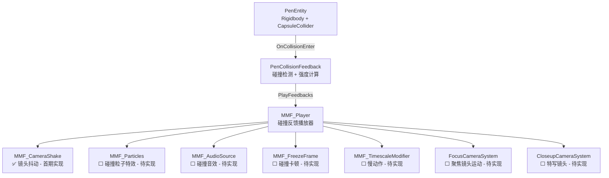
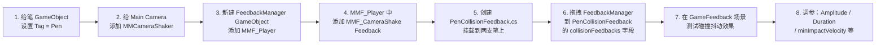

# Feel 音效与视觉反馈集成架构规划

> 项目：Pen —— 钢笔弹射对战游戏  
> 阶段：首期实现「两支笔碰撞时的镜头抖动」，同时预留完整反馈系统扩展位置

---

## 一、总体架构概览



---

## 二、核心设计原则

1. **非侵入式集成**：不修改 `PenEntity`、`ActionState` 等核心逻辑，通过 `AddComponent` 方式附加反馈组件
2. **强度驱动反馈**：碰撞冲击力（相对速度 × 质量）决定反馈强度，实现轻碰微抖、重击强震的差异化体验
3. **MMF_Player 为统一入口**：所有反馈统一挂载在一个 `MMF_Player` 上，便于在 Inspector 中调整和扩展
4. **Shaker 架构**：镜头上挂 `MMCameraShaker`，MMF_Player 通过事件广播驱动，Camera 与反馈逻辑解耦

---

## 三、首期实现：镜头抖动

### 3.1 场景组件部署

```
Scene Hierarchy
├── Main Camera
│   └── [Component] MMCameraShaker        ← Feel Shaker，监听抖动事件
│
├── FeedbackManager (新建 GameObject)
│   └── [Component] MMF_Player            ← 碰撞反馈播放器（包含 CameraShake Feedback）
│
├── Player Pen (PenEntity)
│   └── [Component] PenCollisionFeedback  ← 碰撞检测 + 触发反馈（新建脚本）
│
└── Enemy Pen (PenEntity)
    └── [Component] PenCollisionFeedback  ← 同上
```

### 3.2 新建脚本：`PenCollisionFeedback.cs`

**位置**：`Assets/Scripts/Feedbacks/PenCollisionFeedback.cs`

**职责**：
- 挂载在每支 `PenEntity` 上
- 通过 `OnCollisionEnter` 检测是否与另一支笔碰撞（Tag 或 Layer 过滤）
- 计算碰撞强度（`relativeVelocity.magnitude`）
- 调用 `MMF_Player.PlayFeedbacks()` 触发镜头抖动

**关键逻辑伪代码**：

```csharp
// Assets/Scripts/Feedbacks/PenCollisionFeedback.cs
using MoreMountains.Feedbacks;
using UnityEngine;

[RequireComponent(typeof(PenEntity))]
public class PenCollisionFeedback : MonoBehaviour
{
    [Header("反馈配置")]
    [SerializeField] private MMF_Player collisionFeedbacks;    // 碰撞反馈播放器

    [Header("强度映射")]
    [SerializeField] private float minImpactVelocity = 1f;    // 触发反馈的最低速度
    [SerializeField] private float maxImpactVelocity = 10f;   // 对应最大强度的速度

    [Header("碰撞过滤")]
    [SerializeField] private string penTag = "Pen";           // 只响应笔对笔碰撞

    private void OnCollisionEnter(Collision collision)
    {
        if (!collision.gameObject.CompareTag(penTag)) return;

        float impactVelocity = collision.relativeVelocity.magnitude;
        if (impactVelocity < minImpactVelocity) return;

        // 归一化碰撞强度 0~1
        float intensity = Mathf.InverseLerp(minImpactVelocity, maxImpactVelocity, impactVelocity);

        // 驱动 MMF_Player 的强度倍率
        collisionFeedbacks.FeedbacksIntensity = intensity;
        collisionFeedbacks.PlayFeedbacks(collision.contacts[0].point);
    }
}
```

### 3.3 MMF_Player 配置（Inspector 设置）

在 `FeedbackManager` 的 `MMF_Player` 中添加：

| Feedback 类型 | 关键参数 | 推荐值 |
|---|---|---|
| **MMF_CameraShake** | Duration | 0.3s |
| | Amplitude | 0.1（由 Intensity 倍率缩放） |
| | Frequency | 25 |
| | Channel | 0（与 MMCameraShaker 匹配） |

### 3.4 Camera 配置

`Main Camera` 上添加 `MMCameraShaker` 组件，保持默认设置，监听 Channel 0 的抖动事件。

---

## 四、后续反馈系统预留位置

以下模块全部作为 `MMF_Player` 中的额外 Feedback 条目，统一在 `PenCollisionFeedback` 触发时一并播放，只需在 Inspector 添加并启用/禁用即可。

### 4.1 ⬜ 碰撞粒子特效

**Feel 工具**：`MMF_Particles` 或 `MMF_ParticlesInstantiation`

| 配置项 | 说明 |
|---|---|
| Particle System | 碰撞火花 / 碎屑粒子预制体 |
| PositionMode | FeedbackPosition（跟随碰撞接触点） |
| 扩展脚本位置 | `Assets/Scripts/Feedbacks/PenCollisionFeedback.cs`（在 OnCollisionEnter 传入 `collision.contacts[0].point`） |

---

### 4.2 ⬜ 碰撞音效

**Feel 工具**：`MMF_AudioSource`

| 配置项 | 说明 |
|---|---|
| AudioClip | 碰撞 SFX 音频文件 |
| Pitch 随机化 | ±0.1 防止重复感 |
| Volume 曲线 | 与 `FeedbacksIntensity` 挂钩 |

---

### 4.3 ⬜ 碰撞卡顿（Hit Stop）

**Feel 工具**：`MMF_FreezeFrame`

| 配置项 | 说明 |
|---|---|
| FreezeFrameDuration | 0.05~0.1s（轻碰短、重击长） |
| 实现思路 | 碰撞瞬间 `Time.timeScale = 0` 持续几帧后恢复 |

---

### 4.4 ⬜ 慢动作（Bullet Time）

**Feel 工具**：`MMF_TimescaleModifier`

| 配置项 | 说明 |
|---|---|
| TimeScale | 0.2~0.3（触发时缩减） |
| Duration | 0.5~1.5s |
| Restore Speed | 渐变回 1.0（避免突兀） |
| 触发条件建议 | 仅在高强度碰撞（intensity > 0.8）时触发 |

---

### 4.5 ⬜ 聚焦镜头运动系统

**设计思路**：战斗中，镜头平滑对准两笔的中心点，始终保证两只笔都在画面内，并根据两笔间距动态调整 FOV

**Feel 工具**：Cinemachine `CinemachineTargetGroup` + `CinemachineVirtualCamera`（Framing Transposer）

| 配置项 | 说明 |
|---|---|
| TargetGroup Targets | 运行时注册两支笔 Transform，各权重 1 |
| Framing Transposer | 自动居中 TargetGroup 包围盒，动态推算安全距离 |
| FOV 范围 | 设置上下限（如 25°~70°），防止过度拉近或拉远 |
| X/Y/Z Damping | 控制位移与 FOV 的平滑过渡速度 |
| 扩展脚本位置 | `Assets/Scripts/Feedbacks/FocusCameraController.cs`（注册目标 + 约束 FOV 上下限） |

---

### 4.6 ⬜ 特写镜头（Close-up Shot）

**设计思路**：结算瞬间或重击时切换到「掉落笔的特写」虚拟摄像机

**扩展方案**：
- 两个 Cinemachine Virtual Camera：`GameplayCamera` 和 `CloseupCamera`
- `ResultState.Enter()` 中触发镜头切换
- Feel 配合：`MMF_CameraZoom` 或 `MMF_FreezeFrame` + 镜头切换 Event

---

## 五、目录结构规划

```
Assets/Scripts/
└── Feedbacks/                          ← 新建目录
    ├── PenCollisionFeedback.cs         ✅ 首期实现（碰撞检测 + 镜头抖动触发）
    ├── FocusCameraController.cs        ⬜ 聚焦镜头运动系统
    └── CloseupCameraController.cs      ⬜ 特写镜头控制器

Assets/Prefabs/
└── FeedbackManager.prefab              ✅ 首期实现（含 MMF_Player 配置）
```

---

## 六、实施步骤（首期：镜头抖动）



---

## 七、扩展性说明

- 所有后续反馈只需在同一个 `MMF_Player` 中**添加新 Feedback 条目**，无需修改 `PenCollisionFeedback.cs` 核心逻辑
- 不同强度的碰撞通过 `FeedbacksIntensity` 统一缩放，各 Feedback 的曲线独立调整
- 若需区分「轻碰」vs「重击」反馈集，可在 `PenCollisionFeedback` 中维护两个 `MMF_Player` 引用，通过强度阈值选择播放
